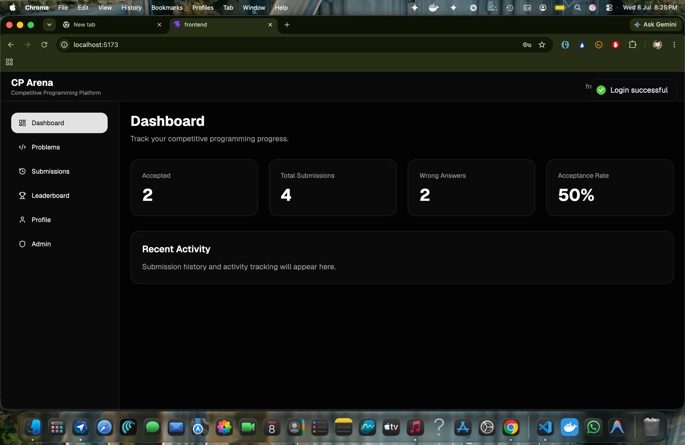
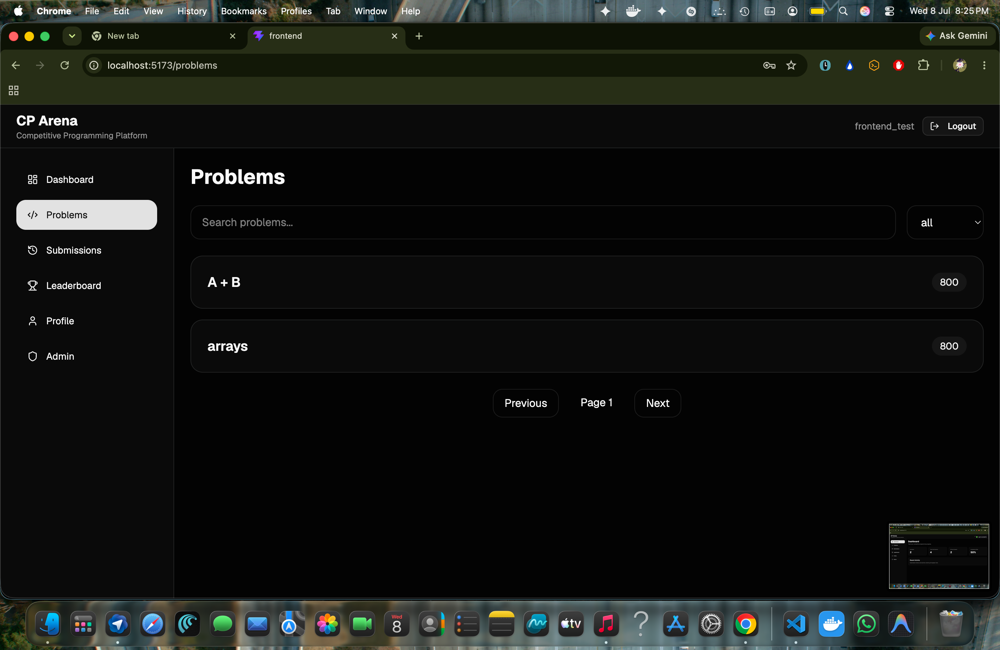
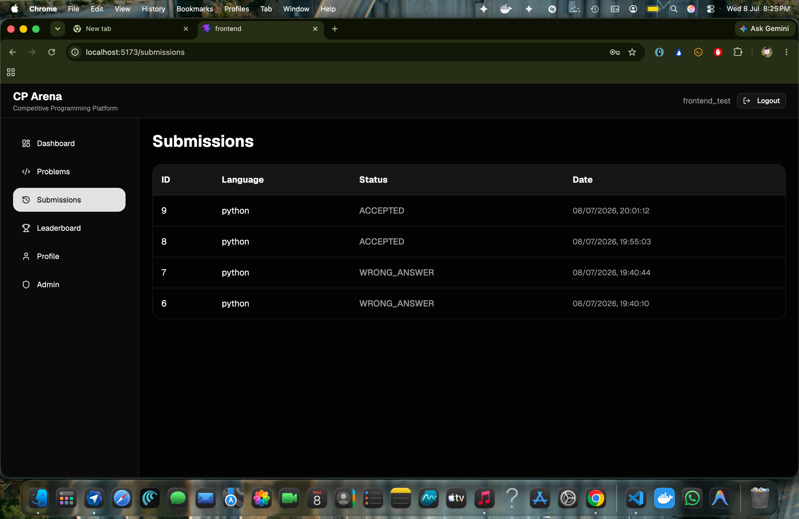
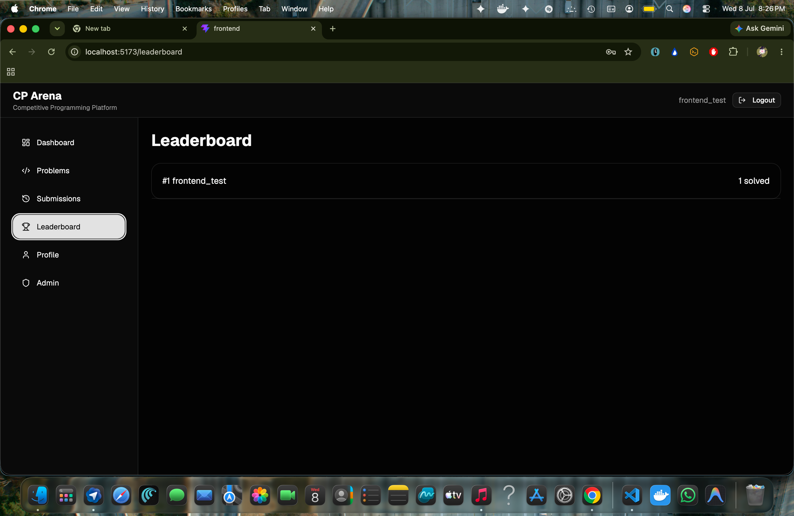
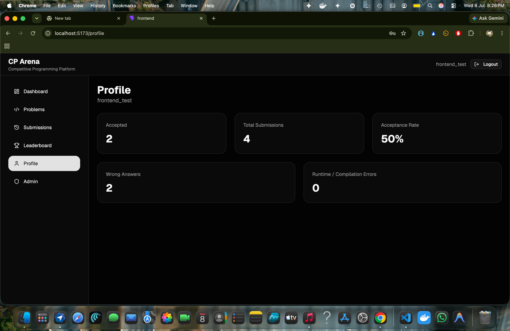
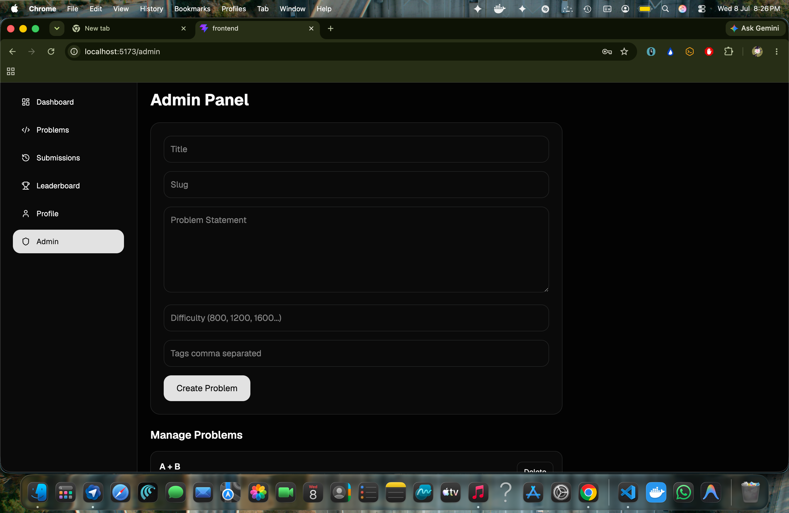
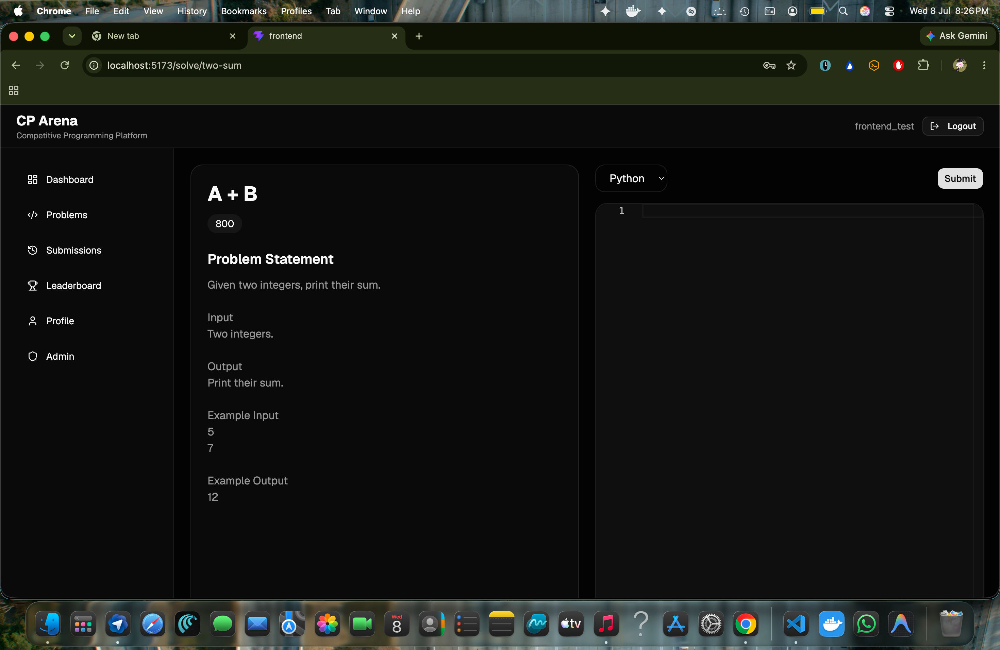

# 🚀 CP Arena

A production-inspired Competitive Programming Platform built with **FastAPI**, **React**, **TypeScript**, **PostgreSQL**, **Redis**, and **Docker**.

Designed with clean architecture, repository pattern, JWT authentication, asynchronous judging, caching, pagination, filtering, and a modern frontend.

---

## 📷 Screenshots

### Login



---

### Dashboard



---

### Problems



---

### Problem Details



---

### Submissions



---

### Leaderboard



---

### Profile



---

# Features

## Authentication

- JWT Authentication
- Login
- Registration
- Protected Routes
- Role Based Authorization

---

## Problem Management

- Create Problems
- Delete Problems
- Difficulty Levels
- Tags
- Pagination
- Search
- Filtering

---

## Online Judge

- Docker Sandbox
- Queue-based Judging
- Redis Queue
- Worker Architecture
- Test Case Validation
- Multiple Verdicts
- Runtime Tracking

---

## User Features

- Dashboard
- Profile
- Submission History
- Leaderboard
- User Statistics

---

## Backend

- FastAPI
- SQLAlchemy
- Alembic
- PostgreSQL
- Redis
- Docker
- Repository Pattern
- Service Layer
- Dependency Injection

---

## Frontend

- React
- TypeScript
- Vite
- React Query
- Axios
- TailwindCSS
- React Router

---

# Tech Stack

| Backend | Frontend | Database | DevOps |
|----------|----------|----------|---------|
| FastAPI | React | PostgreSQL | Docker |
| SQLAlchemy | TypeScript | Redis | Docker Compose |
| Alembic | Tailwind CSS | | GitHub |

---

# Project Structure

```
cp-arena/
│
├── app/
├── frontend/
├── tests/
├── alembic/
├── docs/
│   └── images/
├── requirements/
└── README.md
```

---

# Running the Project

## Backend

```bash
git clone https://github.com/Vatsalsamarth/cp-arena.git

cd cp-arena

python -m venv .venv

source .venv/bin/activate

pip install -r requirements.txt

make migrate

make run
```

## Frontend

```bash
cd frontend

npm install

npm run dev
```

---

# API Highlights

- JWT Authentication
- User Management
- Problem CRUD
- Submission API
- Leaderboard
- Dashboard Statistics
- Profile
- Pagination
- Search
- Filtering

---

# Architecture

```
React Frontend
      │
      ▼
 FastAPI REST API
      │
      ▼
 Service Layer
      │
      ▼
 Repository Layer
      │
      ▼
 PostgreSQL

          │
          ▼

 Redis Queue

          │
          ▼

 Judge Worker

          │
          ▼

 Docker Sandbox
```

---

# Future Improvements

- Contest System
- Code Editor
- Multiple Languages
- Real-time Leaderboard
- Rating System
- Discussion Forum
- Editorials
- Plagiarism Detection
- Email Verification
- OAuth Login

---

# License

MIT License